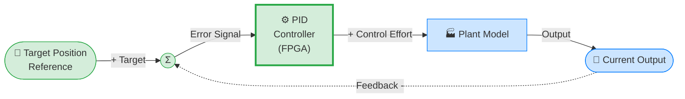

# hil.tron

## Resume

`hil.tron` is a digital logic project that implements a **PID controller** designed to run on a **Tang Nano 9K FPGA**. The controller is capable of communicating with external systems via UART to receive setpoints, PID gains ($K_p$, $K_i$, $K_d$), and feedback signals, and to transmit the computed control effort back. It is intended to be used as part of a Hardware-In-the-Loop (HIL) simulation setup. The build process and toolchain integration have been successfully tested on **Fedora v42 Linux**.

## Contents

- [Resume](#resume)
- [Architecture](#architecture)
- [Project Structure](#project-structure)
- [Prerequisites](#prerequisites)
- [Building](#building)
- [Running](#running)
- [Testing](#testing)
- [Documentation](#documentation)
- [Dependencies](#dependencies)

## Architecture

The system is structured around several hardware modules implemented in Verilog/SystemVerilog, all instantiated within the top-level module (`top.v`):

- **UART Module**: Handles serial communication (RX/TX) between the FPGA and the external world.
- **Input Control**: Decodes incoming packets and routes the data to the appropriate registers.
- **Registers**: Stores the controller parameters and state:
  - **Setpoint**: The target reference value.
  - **$K_p$, $K_i$, $K_d$**: The Proportional, Integral, and Derivative gains.
- **Decode & Encode**: Handles data conversion and framing for the UART interface.
- **PID Controller**: The core computation module that calculates the control output based on the error (Setpoint - Feedback) and the given gains.

A diagram of the conceptual control loop can be found below:



## Project Structure

Here is a high-level overview of the main directories in the repository:

```text
.
├── build         # Generated bitstream and build artifacts
├── ci            # Docker and CI/CD configuration files
├── dev-rules     # udev rules for the FPGA programmer
├── docs          # Documentation, diagrams, hardware specs, and tests
├── rtl           # Source code for the FPGA (Verilog/SystemVerilog)
│   ├── controller    # PID controller module
│   ├── decode        # Protocol decoding
│   ├── encode        # Protocol encoding
│   ├── input_control # Data routing and opcodes
│   ├── uart          # UART RX/TX modules
│   └── util          # General utility modules (registers, debounce)
├── software      # Software components
└── syn           # Synthesis files and physical constraints (e.g., .cst)
```

## Prerequisites

To synthesize the design, run tests, and program the FPGA, you will need the open-source FPGA toolchain.

- **Synthesis & Place and Route**: `yosys`, `nextpnr-himbaechel`, and `gowin_pack`.
- **Programming**: `openFPGALoader`.
- **Linting & Formatting (Optional)**: `verible` or `ghdl` (depending on the HDL used).
- **Docker (Optional)**: A Docker environment is available to run all tools without local installation.

## Building

The project uses a `Makefile` to automate the build process.

To build the bitstream locally (this will run synthesis, place & route, and pack):
```bash
make all
```

If you prefer using **Docker** to avoid installing the toolchain locally:
```bash
make docker-build  # Build the container image
make docker-all    # Run the full compilation inside Docker
```

You can also run individual steps:
- `make synth`: Runs Synthesis using Yosys.
- `make pnr`: Runs Place & Route using NextPNR.
- `make pack`: Runs Packing (generates the `.fs` bitstream).

## Running

Once the bitstream is generated (`build/top.fs`), you can program the Tang Nano 9K board.

To write to the **SRAM** (volatile, faster, lost on power cycle):
```bash
make flash-sram
```

To write to the **Flash** (non-volatile, persistent):
```bash
make flash
```

To just detect the connected FPGA board:
```bash
make detect
```

### Install tools

Before write the program, install the tools:

```bash
make install-tools
```
Or, to manually install just the udev rules:
```bash
sudo cp dev-rules/99-openfpgaloader.rules /etc/udev/rules.d/
sudo udevadm control --reload-rules && sudo udevadm trigger
```

## Testing

The project includes targets for static analysis and formatting to ensure code quality:

- **Linting**: Run `make lint` (or `make docker-lint`) to check for code issues.
- **Formatting**: Run `make format` (or `make docker-format`) to automatically format the source files.
- **Check Format**: Run `make check-format` (or `make docker-check-format`) to verify if the files follow the formatting rules.

## Documentation

Additional documentation and specifications can be found in the `docs/` directory:

- `docs/components/`: Details about specific modules, like the `uart`.
- `docs/hardware/`: Contains datasheets, schematics, 3D models, and dimensional drawings for the Tang Nano 9K and related components.
- `docs/testing/`: Information on testing procedures (control systems, fixed-point math, etc.).
- `docs/diagrams/`: Visual diagrams of the system's sub-modules (Decode, Encode, Transmitter, Receiver, Top).

## Dependencies

- **Yosys**: For RTL synthesis.
- **NextPNR**: Place and route tool for FPGAs (`nextpnr-himbaechel` specifically for Gowin).
- **Gowin Tools**: `gowin_pack` for generating the final bitstream.
- **openFPGALoader**: Universal utility for programming FPGAs.
- **Verible**: Suite of SystemVerilog developer tools (linter, formatter).
- **udev rules (`dev-rules/`)**: Required on Linux so `openFPGALoader` can access the FPGA via USB without root privileges.