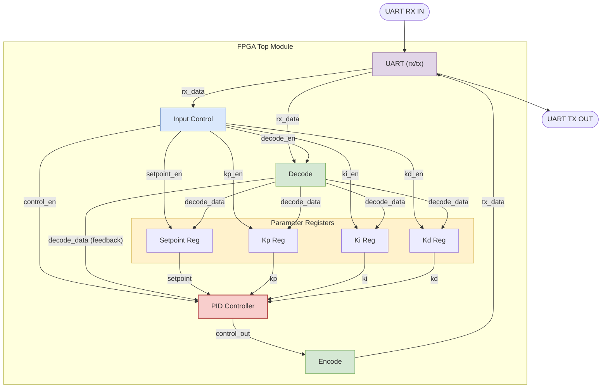
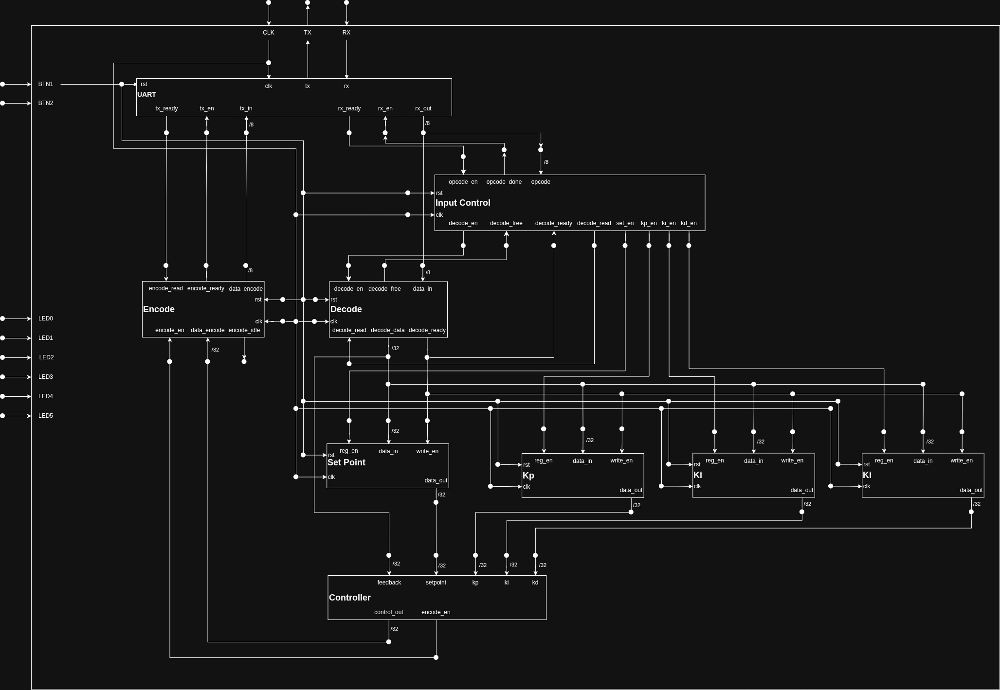
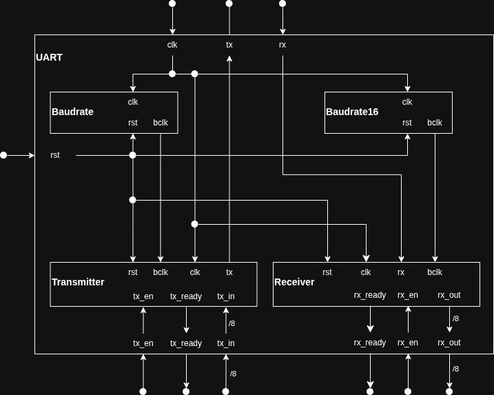
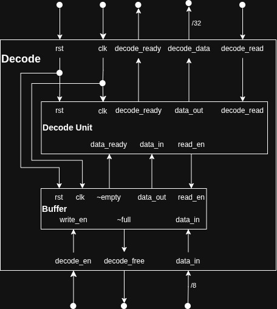
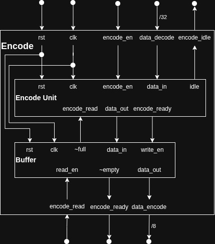
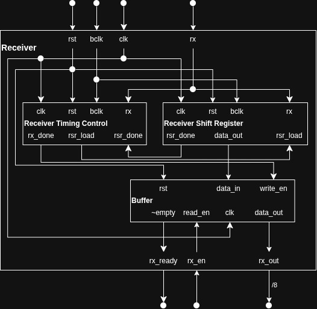
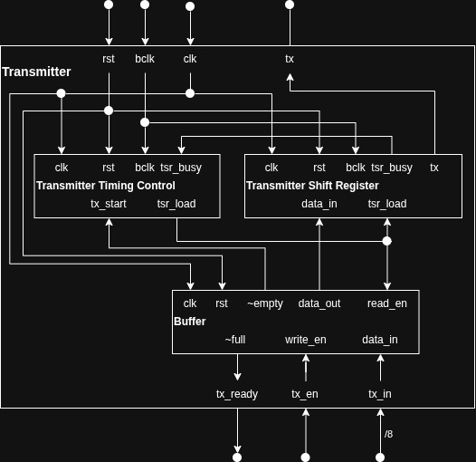

# FPGA Architecture

This document describes the internal structure and data flow of the `hil.tron` PID Controller implemented on the FPGA. The design is modular, separating communication, control logic, data routing, and parameter storage.

## Block Diagram

The following diagram illustrates how the components inside the FPGA are connected, primarily focusing on the data flow from the UART interface, through the controller, and back out.

## Module Descriptions

1. **UART (`uart_inst`)**: 
   The main communication interface with the outside world (usually a PC or HIL simulator). It receives bytes serially (`RX_IN`) and translates them into an 8-bit `rx_data` bus, and similarly takes `tx_data` bytes to send serially via `TX_OUT`.

2. **Input Control (`input_control_inst`)**: 
   Acts as the system's traffic director. It monitors the incoming data from the UART (`opcode`) and determines the destination. Based on the opcode, it asserts enable signals (`setpoint_en`, `kp_en`, `ki_en`, `kd_en`, `control_en`) so the correct module captures the subsequent decoded data.

3. **Decode (`decode_inst`)**: 
   Converts the raw incoming byte stream from the UART into formatted 32-bit `decode_data`. This data is then consumed by the registers (to update parameters) or by the controller (as feedback).

4. **Encode (`encode_inst`)**: 
   The counterpart to Decode. It takes the 32-bit `control_out` calculated by the PID controller and breaks it down into a byte stream that the UART can transmit back to the host.

5. **Registers (`setpoint_inst`, `kp_register_inst`, `ki_register_inst`, `kd_register_inst`)**: 
   A bank of 32-bit registers. They latch the 32-bit `decode_data` when their respective `enable` signals are asserted by the Input Control. These registers hold the PID gains and the target reference value.

6. **PID Controller (`controller_inst`)**: 
   The computational heart of the design. It takes the parameters from the Registers (`setpoint`, `kp`, `ki`, `kd`) and the plant `feedback` from the Decode module. It continuously calculates the error and produces a new `control_out` signal (the control effort) to correct the plant, forwarding it to the Encode module for transmission.

## RTL Schematic Diagrams

The following schematics provide a lower-level view of the RTL modules and their datapaths:

### Top Module

### UART

### Decode

### Encode

### Receiver

### Transmitter

