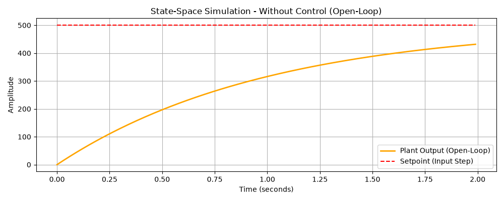
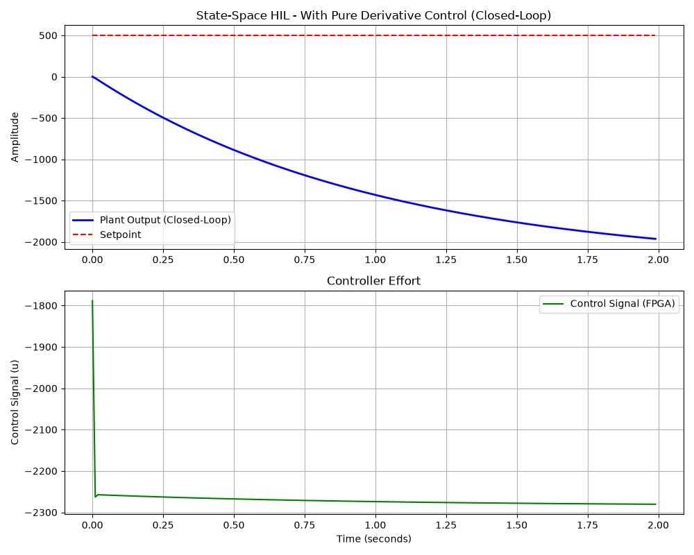

# Proportional-Integral-Derivative (PID) Control Comparison

This document compares the Hardware-in-the-Loop (HIL) plant simulation results with and without the FPGA-based PID controller. The simulation is driven by the [HIL Simulation Script](#hil-simulation-script).

## Plant Transfer Function

The plant is modeled as a continuous first-order system with the following parameters:
- **Plant Proportional Gain ($K_{plant}$)**: 1.0
- **Time Constant ($\tau$)**: 1.0 second

The continuous transfer function $G(s)$ is:
$$G(s) = \frac{K_{plant}}{\tau s + 1} = \frac{1}{s + 1}$$

### Open-Loop Characteristics (Without Control)
- **Pole**: $s = -1$ (Stable, left-half plane)
- **Cutoff Frequency ($\omega_c$)**: $1/\tau = 1$ rad/s
- **Rise Time (10% to 90%)**: $\approx 2.2\tau = 2.2$ seconds
- **Settling Time (2% band)**: $\approx 4\tau = 4.0$ seconds

In the open-loop test, a step input (setpoint) is applied directly to the plant. Because the plant gain is 1.0, the steady-state output will eventually reach the input value. 



*(Note: In the plot above, the open-loop response exponentially approaches the setpoint, taking roughly 4.0 seconds to settle.)*

---

## Closed-Loop System (With PID Control)

For the closed-loop HIL simulation, the FPGA computes the control effort $u(t)$ based on the error between the setpoint and the plant output. To avoid the "derivative kick" when the setpoint changes, the Derivative action is calculated based on the measurement (feedback) instead of the error.

### Controller Parameters
- **Setpoint**: $500.0$
- **Controller Proportional Gain ($K_p$)**: $15.75$
- **Controller Integral Gain ($K_i$)**: $3.4$
- **Controller Derivative Gain ($K_d$)**: $1.2$

The PI action operates on the error $E(s)$, while the Derivative action operates on the plant output $Y(s)$:
$$U(s) = \left(K_p + \frac{K_i}{s}\right) E(s) - (K_d s) Y(s)$$

By substituting $E(s) = R(s) - Y(s)$, the effective closed-loop transfer function $T(s) = \frac{Y(s)}{R(s)}$ is derived as:
$$T(s) = \frac{15.75 s + 3.4}{1.2 s^2 + 16.75 s + 3.4}$$

### Closed-Loop Characteristics
- **New Poles**: $s_1 \approx -7.40$, $s_2 \approx -0.21$ (Both stable, left-half plane)
- **New Zero**: $s \approx -0.22$
- **System Dynamics**: The system is second-order. The zero at $-0.22$ closely cancels the slow pole at $-0.21$, leaving the fast pole ($s_1 \approx -7.40$) to dictate the dominant transient response. While slightly slower than the pure PI system, the Derivative action increases the system's damping, significantly reducing any potential overshoot.
- **Closed-Loop DC Gain**: $\frac{3.4}{3.4} = 1.0$ (Zero steady-state error)



### Analysis of the Results

1. **Damping and Speed**: The derivative term acts as a "brake" to the proportional control, predicting future errors and slowing the system down as it approaches the setpoint to prevent overshoot. 
2. **Derivative Kick Prevention**: Because the derivative term is based purely on the feedback measurement (Process Variable) rather than the error, the massive instantaneous spike (impulse) in control effort that normally accompanies a step change in setpoint is entirely avoided.
3. **Steady-State Error**: The integral (I) action integrates the error over time, continuing to force the steady-state error to zero precisely.

---

## Dependencies

To run this simulation, you will need to install the required Python libraries (`pyserial`, `numpy`, `matplotlib`, and `control`). Run the following commands in the same folder of [HIL Simulation Script](#hil-simulation-script) to create a Python virtual environment and install the dependencies:

```bash
python3 -m venv venv
sudo venv/bin/python3 -m pip install pyserial numpy matplotlib control
```

## HIL Simulation Script (Difference Equations)

The simulation script used to generate these results is provided below. This script configures all three PID gains dynamically via UART opcodes, runs the Hardware-in-the-Loop test, and plots the results.

```python
import serial
import time
import struct
import sys
import numpy as np
import matplotlib.pyplot as plt
import control as ct
print("python-control", ct.__version__)

def main():
    # 1. Setup Serial Port
    port = '/dev/ttyUSB1'
    baudrate = 115200
 
    try:
        ser = serial.Serial(port, baudrate, timeout=2.0)
        print(f"Opened {port} at {baudrate} baud.")
    except Exception as e:
        print(f"Error opening serial port: {e}")
        sys.exit(1)

    # 2. Define the Plant using Python Control Library
    K_plant = 1.0
    tau = 1.0
    sys_c = ct.tf([K_plant], [tau, 1])
    print(f"\nContinuous Plant Transfer Function:\n{sys_c}")

    # Convert to Discrete difference equations
    dt = 0.01 # 10 ms sample time
    sys_d = ct.sample_system(sys_c, dt, method='zoh')

    b = sys_d.num[0][0]
    a = sys_d.den[0][0]
    
    if len(b) < len(a):
        b = np.pad(b, (len(a) - len(b), 0), 'constant')
    
    b = b / a[0]
    a = a / a[0]

    # 3. Setup HIL Simulation Parameters
    setpoint_float = 500.0
    ser.write(b'\x01' + struct.pack('<i', int(setpoint_float * 65536)))
    time.sleep(0.01)

    kp_float = 15.75
    ser.write(b'\x02' + struct.pack('<i', int(kp_float * 65536)))
    time.sleep(0.01)

    ki_float = 3.4
    ser.write(b'\x03' + struct.pack('<i', int(ki_float * 65536)))
    time.sleep(0.01)
    
    kd_float = 1.2
    ser.write(b'\x04' + struct.pack('<i', int(kd_float * 65536)))
    time.sleep(0.01)

    # 4. Run the HIL Simulation Loop
    num_steps = 200

    y_hist = np.zeros(len(a))
    u_hist = np.zeros(len(b))
    y_open_hist = np.zeros(len(a))
    u_open_hist = np.zeros(len(b))

    history_t = []
    history_y = []
    history_y_open = []
    history_u = []
    history_setpoint = []

    print("\nStarting Hardware-in-the-Loop Simulation...")
    start_sim_time = time.time()

    for k in range(num_steps):
        for i in range(len(a)-1, 0, -1):
            y_hist[i] = y_hist[i-1]
            y_open_hist[i] = y_open_hist[i-1]
        for i in range(len(b)-1, 0, -1):
            u_hist[i] = u_hist[i-1]
            u_open_hist[i] = u_open_hist[i-1]

        y_float = 0.0
        y_open_float = 0.0
        for i in range(1, len(a)):
            if i < len(y_hist):
                y_float -= a[i] * y_hist[i]
                y_open_float -= a[i] * y_open_hist[i]
        for i in range(1, len(b)):
            if i < len(u_hist):
                y_float += b[i] * u_hist[i]
                y_open_float += b[i] * u_open_hist[i]

        y_hist[0] = y_float
        y_open_hist[0] = y_open_float

        y_q16 = int(y_float * 65536)
        ser.write(b'\x00' + struct.pack('<i', y_q16))

        response = ser.read(4)

        if len(response) == 4:
            u_q16 = struct.unpack('<i', response)[0]
            u_float = u_q16 / 65536.0
        else:
            print(f"Error: Step {k} failed to receive full response. Using u = 0.")
            u_float = 0.0

        u_hist[0] = u_float
        u_open_hist[0] = setpoint_float

        t = k * dt
        history_t.append(t)
        history_y.append(y_float)
        history_u.append(u_float)
        history_setpoint.append(setpoint_float)
        history_y_open.append(y_open_float)

    ser.close()
    print(f"Simulation finished in {time.time() - start_sim_time:.2f} seconds.")

    # 5. Plot the Results
    plt.figure(figsize=(10, 8))

    plt.subplot(2, 1, 1)
    plt.plot(history_t, history_y, label='Plant Output (Closed-Loop)', color='blue', linewidth=2)
    plt.plot(history_t, history_setpoint, label='Setpoint', color='red', linestyle='--')
    plt.title('Hardware-in-the-Loop - With PID Control (Closed-Loop)')
    plt.ylabel('Amplitude')
    plt.grid(True)
    plt.legend()

    plt.subplot(2, 1, 2)
    plt.plot(history_t, history_u, label='Control Signal (FPGA)', color='green')
    plt.title('Controller Effort')
    plt.xlabel('Time (seconds)')
    plt.ylabel('Control Signal (u)')
    plt.grid(True)
    plt.legend()

    plt.tight_layout()
    plt.savefig('hil_with_control.png')

    plt.figure(figsize=(10, 4))
    plt.plot(history_t, history_y_open, label='Plant Output (Open-Loop)', color='orange', linewidth=2)
    plt.plot(history_t, history_setpoint, label='Setpoint (Input Step)', color='red', linestyle='--')
    plt.title('Plant Simulation - Without Control (Open-Loop Step Response)')
    plt.xlabel('Time (seconds)')
    plt.ylabel('Amplitude')
    plt.grid(True)
    plt.legend()

    plt.tight_layout()
    plt.savefig('hil_without_control.png')

    print("\nPlots saved as 'hil_with_control.png' and 'hil_without_control.png'")

if __name__ == '__main__':
    main()
```
