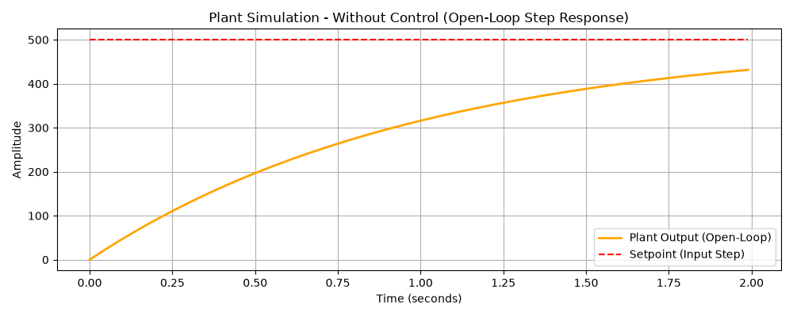
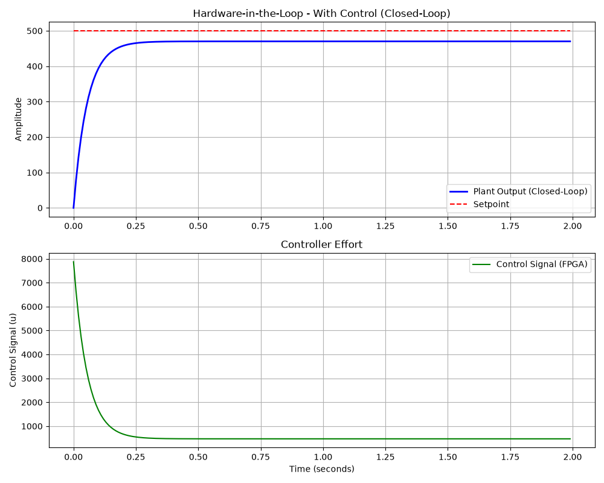

# Proportional Control Comparison

This document compares the Hardware-in-the-Loop (HIL) plant simulation results with and without the FPGA-based proportional controller. The simulation is driven by the [HIL Simulation Script](#hil-simulation-script).

## Plant Transfer Function

The plant is modeled as a continuous first-order system with the following parameters:
- **Plant Proportional Gain ($K_{plant}$)**: 1.0
- **Time Constant ($\tau$)**: 1.0 second

The continuous transfer function $G(s)$ is:
$$G(s) = \frac{K_{plant}}{\tau s + 1} = \frac{1}{s + 1}$$

### Open-Loop Characteristics (Without Control)
- **Pole**: $s = -1$ (Stable, left-half plane)
- **Cutoff Frequency ($\omega_c$)**: $1/\tau = 1$ rad/s
- **Rise Time (10% to 90%)**: $\approx 2.2\tau = 2.2$ seconds
- **Settling Time (2% band)**: $\approx 4\tau = 4.0$ seconds

In the open-loop test, a step input (setpoint) is applied directly to the plant. Because the plant gain is 1.0, the steady-state output will eventually reach the input value. 



*(Note: In the plot above, the open-loop response exponentially approaches the setpoint, taking roughly 4.0 seconds to settle.)*

---

## Closed-Loop System (With Proportional Control)

For the closed-loop HIL simulation, the FPGA computes the control effort $u(t)$ based on the error between the setpoint and the plant output. 

### Controller Parameters
- **Setpoint**: $500.0$
- **Controller Proportional Gain ($K_p$)**: $15.75$

With the proportional controller, the open-loop transfer function becomes $L(s) = \frac{15.75}{s + 1}$, and the closed-loop transfer function $T(s)$ is:
$$T(s) = \frac{L(s)}{1 + L(s)} = \frac{15.75}{s + 16.75}$$

### Closed-Loop Characteristics
- **New Pole**: $s = -16.75$ (Moved further left, making the system significantly faster)
- **New Time Constant ($\tau_{cl}$)**: $1 / 16.75 \approx 0.06$ seconds
- **New Rise Time**: $\approx 2.2 \times 0.06 \approx 0.13$ seconds
- **New Settling Time**: $\approx 4 \times 0.06 \approx 0.24$ seconds
- **Closed-Loop DC Gain**: $\frac{15.75}{16.75} \approx 0.94$



### Analysis of the Results

1. **Speed of Response**: The system with control is significantly faster. The settling time drops from $4.0$ seconds to just $0.24$ seconds because the controller gain "pushes" the pole deeper into the stable region.
2. **Steady-State Error**: Because this is a pure proportional (P) controller acting on a Type-0 plant, there is a steady-state error. 
   - Expected Steady-State Output: $500 \times 0.94 = 470$
   - Steady-State Error: $500 - 470 = 30$
   As seen in the "With Control" plot, the plant output stabilizes below the 500 setpoint. To eliminate this error, an integral (I) term would need to be added to the controller.
3. **Control Effort ($u$)**: The controller initially commands a massive spike in effort ($u = K_p \times \text{Error} = 15.75 \times 500 = 7875$) to quickly drive the plant output up, which then decays as the error decreases.

---

## Dependencies

To run this simulation, you will need to install the required Python libraries (`pyserial`, `numpy`, `matplotlib`, and `control`). Run the following commands in the same folder of [HIL Simulation Script](#hil-simulation-script) to create a Python virtual environment and install the dependencies:

```bash
python3 -m venv venv
sudo venv/bin/python3 -m pip install pyserial numpy matplotlib control
```

## V2 HIL Simulation Script (Difference Equations)

The simulation script used to generate these results is provided below. This script defines the continuous plant, converts it to discrete difference equations, configures the FPGA over UART using the new opcodes, runs the Hardware-in-the-Loop test, and plots the results.

```python
import serial
import time
import struct
import sys
import numpy as np
import matplotlib.pyplot as plt
import control as ct
print("python-control", ct.__version__)

def main():
    # 1. Setup Serial Port
    port = '/dev/ttyUSB1'
    baudrate = 115200
 
    try:
        ser = serial.Serial(port, baudrate, timeout=2.0)
        print(f"Opened {port} at {baudrate} baud.")
    except Exception as e:
        print(f"Error opening serial port: {e}")
        sys.exit(1)

    # 2. Define the Plant using Python Control Library
    # Let's create a simple first-order system
    # G(s) = K / (tau * s + 1)
    K_plant = 1.0
    tau = 1.0
    sys_c = ct.tf([K_plant], [tau, 1])
    print(f"\nContinuous Plant Transfer Function:\n{sys_c}")

    # Convert to Discrete difference equations
    dt = 0.01 # 10 ms sample time
    sys_d = ct.sample_system(sys_c, dt, method='zoh')

    b = sys_d.num[0][0]
    a = sys_d.den[0][0]
    
    # Pad numerator with leading zeros to match denominator length
    # This ensures b aligns with the correct delays (e.g. u[k-1])
    if len(b) < len(a):
        b = np.pad(b, (len(a) - len(b), 0), 'constant')
    
    # Normalize by leading denominator coefficient
    b = b / a[0]
    a = a / a[0]

    # 3. Setup HIL Simulation Parameters
    setpoint_float = 500.0
    setpoint_q16 = int(setpoint_float * 65536)

    # Send Setpoint Packet (Opcode 0x01)
    setpoint_bytes = struct.pack('<i', setpoint_q16)
    setpoint_packet = b'\x01' + setpoint_bytes
    print(f"Sending setpoint: {setpoint_float:.4f}")
    ser.write(setpoint_packet)

    # Give a tiny delay for the FPGA to process the setpoint
    time.sleep(0.01)

    kp_float = 15.75
    kp_q16 = int(kp_float * 65536)

    # Send Kp Packet (Opcode 0x02)
    kp_bytes = struct.pack('<i', kp_q16)
    kp_packet = b'\x02' + kp_bytes
    print(f"Sending Kp: {kp_float:.4f}")
    ser.write(kp_packet)

    # Give a tiny delay for the FPGA to process Kp
    time.sleep(0.01)

    # 4. Run the HIL Simulation Loop
    num_steps = 200  # 200 steps * 0.01s = 2.0 seconds of simulation

    y_hist = np.zeros(len(a))
    u_hist = np.zeros(len(b))

    y_open_hist = np.zeros(len(a))
    u_open_hist = np.zeros(len(b))

    history_t = []
    history_y = []
    history_y_open = []
    history_u = []
    history_setpoint = []

    print("\nStarting Hardware-in-the-Loop Simulation...")
    start_sim_time = time.time()

    for k in range(num_steps):
        # Shift histories for difference equations
        for i in range(len(a)-1, 0, -1):
            y_hist[i] = y_hist[i-1]
            y_open_hist[i] = y_open_hist[i-1]
        for i in range(len(b)-1, 0, -1):
            u_hist[i] = u_hist[i-1]
            u_open_hist[i] = u_open_hist[i-1]

        # Calculate current output of the plant using difference equation
        y_float = 0.0
        y_open_float = 0.0
        for i in range(1, len(a)):
            if i < len(y_hist):
                y_float -= a[i] * y_hist[i]
                y_open_float -= a[i] * y_open_hist[i]
        for i in range(1, len(b)):
            if i < len(u_hist):
                y_float += b[i] * u_hist[i]
                y_open_float += b[i] * u_open_hist[i]

        y_hist[0] = y_float
        y_open_hist[0] = y_open_float

        # Quantize to Q16.16 format for the FPGA
        y_q16 = int(y_float * 65536)

        # Send current plant output (feedback) to FPGA (Opcode 0x00)
        data_packet = b'\x00' + struct.pack('<i', y_q16)
        ser.write(data_packet)

        # Wait for the control signal (u) from FPGA
        response = ser.read(4)

        if len(response) == 4:
            # Result from FPGA is Q16.16 signed integer
            u_q16 = struct.unpack('<i', response)[0]
            u_float = u_q16 / 65536.0
        else:
            print(f"Error: Step {k} failed to receive full response. Using u = 0.")
            print(f"response={response}")
            u_float = 0.0

        u_hist[0] = u_float
        u_open_hist[0] = setpoint_float

        # Record history for plotting
        t = k * dt
        history_t.append(t)
        history_y.append(y_float)
        history_u.append(u_float)
        history_setpoint.append(setpoint_float)
        history_y_open.append(y_open_float)

    ser.close()
    print(f"Simulation finished in {time.time() - start_sim_time:.2f} seconds.")

    # 5. Plot the Results
    # Graphic 1: With Control
    plt.figure(figsize=(10, 8))

    plt.subplot(2, 1, 1)
    plt.plot(history_t, history_y, label='Plant Output (Closed-Loop)', color='blue', linewidth=2)
    plt.plot(history_t, history_setpoint, label='Setpoint', color='red', linestyle='--')
    plt.title('Hardware-in-the-Loop - With Control (Closed-Loop)')
    plt.ylabel('Amplitude')
    plt.grid(True)
    plt.legend()

    plt.subplot(2, 1, 2)
    plt.plot(history_t, history_u, label='Control Signal (FPGA)', color='green')
    plt.title('Controller Effort')
    plt.xlabel('Time (seconds)')
    plt.ylabel('Control Signal (u)')
    plt.grid(True)
    plt.legend()

    plt.tight_layout()
    plt.savefig('hil_with_control.png')

    # Graphic 2: Without Control
    plt.figure(figsize=(10, 4))
    plt.plot(history_t, history_y_open, label='Plant Output (Open-Loop)', color='orange', linewidth=2)
    plt.plot(history_t, history_setpoint, label='Setpoint (Input Step)', color='red', linestyle='--')
    plt.title('Plant Simulation - Without Control (Open-Loop Step Response)')
    plt.xlabel('Time (seconds)')
    plt.ylabel('Amplitude')
    plt.grid(True)
    plt.legend()

    plt.tight_layout()
    plt.savefig('hil_without_control.png')

    print("\nPlots saved as 'hil_with_control.png' and 'hil_without_control.png'")

if __name__ == '__main__':
    main()
```

### V2 State-Space Simulation Script

Alternatively, you can simulate the physical plant using State-Space matrix multiplication (`A`, `B`, `C`, `D`) instead of difference equations. The script below performs the exact same Hardware-in-the-Loop test but utilizes matrix math, allowing it to naturally scale to higher-order systems without modifying the loop.

```python
import serial
import time
import struct
import sys
import numpy as np
import matplotlib.pyplot as plt
import control as ct

def main():
    # 1. Setup Serial Port
    port = '/dev/ttyUSB1'
    baudrate = 115200
 
    try:
        ser = serial.Serial(port, baudrate, timeout=2.0)
        print(f"Opened {port} at {baudrate} baud.")
    except Exception as e:
        print(f"Error opening serial port: {e}")
        sys.exit(1)

    # 2. Define the Plant using Python Control Library
    K_plant = 1.0
    tau = 1.0
    sys_c = ct.tf([K_plant], [tau, 1])
    print(f"\nContinuous Plant Transfer Function:\n{sys_c}")

    # Convert to Discrete State-Space
    dt = 0.01 # 10 ms sample time
    sys_d = ct.sample_system(sys_c, dt, method='zoh')
    ss_d = ct.tf2ss(sys_d)

    A, B, C, D = ss_d.A, ss_d.B, ss_d.C, ss_d.D

    # 3. Setup HIL Simulation Parameters
    setpoint_float = 500.0
    setpoint_q16 = int(setpoint_float * 65536)

    # Send Setpoint Packet (Opcode 0x01)
    setpoint_bytes = struct.pack('<i', setpoint_q16)
    setpoint_packet = b'\x01' + setpoint_bytes
    print(f"Sending setpoint: {setpoint_float:.4f}")
    ser.write(setpoint_packet)

    time.sleep(0.01)

    kp_float = 15.75
    kp_q16 = int(kp_float * 65536)

    # Send Kp Packet (Opcode 0x02)
    kp_bytes = struct.pack('<i', kp_q16)
    kp_packet = b'\x02' + kp_bytes
    print(f"Sending Kp: {kp_float:.4f}")
    ser.write(kp_packet)

    time.sleep(0.01)

    # 4. Run the HIL Simulation Loop
    num_steps = 200  # 2.0 seconds of simulation

    print("A")
    print(A)
    print("B")
    print(B)
    print("C")
    print(C)
    print("D")
    print(D)

    x = np.zeros((A.shape[0], 1))
    x_open = np.zeros((A.shape[0], 1))

    history_t = []
    history_y = []
    history_y_open = []
    history_u = []
    history_setpoint = []

    print("\nStarting State-Space HIL Simulation...")
    start_sim_time = time.time()

    for k in range(num_steps):
        # Calculate current output using state-space matrices
        y_float = float((C @ x).item())
        y_open_float = float((C @ x_open).item())

        # Quantize to Q16.16 format for the FPGA
        y_q16 = int(y_float * 65536)

        # Send current plant output (feedback) to FPGA (Opcode 0x00)
        data_packet = b'\x00' + struct.pack('<i', y_q16)
        ser.write(data_packet)

        # Wait for the control signal (u) from FPGA
        response = ser.read(4)

        if len(response) == 4:
            u_q16 = struct.unpack('<i', response)[0]
            u_float = u_q16 / 65536.0
        else:
            print(f"Error: Step {k} failed to receive full response. Using u = 0.")
            u_float = 0.0

        # Update the plant states
        x = A @ x + B * u_float
        x_open = A @ x_open + B * setpoint_float

        # Record history for plotting
        t = k * dt
        history_t.append(t)
        history_y.append(y_float)
        history_u.append(u_float)
        history_setpoint.append(setpoint_float)
        history_y_open.append(y_open_float)

    ser.close()
    print(f"Simulation finished in {time.time() - start_sim_time:.2f} seconds.")

    # 5. Plot the Results
    plt.figure(figsize=(10, 8))

    plt.subplot(2, 1, 1)
    plt.plot(history_t, history_y, label='Plant Output (Closed-Loop)', color='blue', linewidth=2)
    plt.plot(history_t, history_setpoint, label='Setpoint', color='red', linestyle='--')
    plt.title('State-Space HIL - With Control (Closed-Loop)')
    plt.ylabel('Amplitude')
    plt.grid(True)
    plt.legend()

    plt.subplot(2, 1, 2)
    plt.plot(history_t, history_u, label='Control Signal (FPGA)', color='green')
    plt.title('Controller Effort')
    plt.xlabel('Time (seconds)')
    plt.ylabel('Control Signal (u)')
    plt.grid(True)
    plt.legend()

    plt.tight_layout()
    plt.savefig('hil_with_control_ss.png')

    plt.figure(figsize=(10, 4))
    plt.plot(history_t, history_y_open, label='Plant Output (Open-Loop)', color='orange', linewidth=2)
    plt.plot(history_t, history_setpoint, label='Setpoint (Input Step)', color='red', linestyle='--')
    plt.title('State-Space Simulation - Without Control (Open-Loop)')
    plt.xlabel('Time (seconds)')
    plt.ylabel('Amplitude')
    plt.grid(True)
    plt.legend()

    plt.tight_layout()
    plt.savefig('hil_without_control_ss.png')

    print("\nPlots saved as 'hil_with_control_ss.png' and 'hil_without_control_ss.png'")

if __name__ == '__main__':
    main()
```

### Run Script

Inside the script folder, after the [Dependencies](#dependencies) commands have been run, execute one of the following commands to run the simulation:

```bash
sudo venv/bin/python3 main.py
```